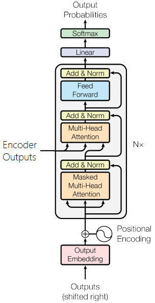

# END3.0-Session10

Sunny Manchanda

## SESSION 10 - Transformers Review

ASSIGNMENT

1. Train the same code, but on different data. If you have n-classes, your accuracy MUST be more than 4 \* 100 / n.
2. Submit the Github link, that includes your notebook with training logs, and proper readme file.

---

## DATASET USED

Multi30k

---

## DIAGRAMS

Transformer

Encoder

Attention

Decoder

---

## REFERENCES

1. Paper: Attention is All You Need <https://arxiv.org/pdf/1706.03762.pdf>
2. The Illustrated Transformer
   <https://jalammar.github.io/illustrated-transformer/>
---
